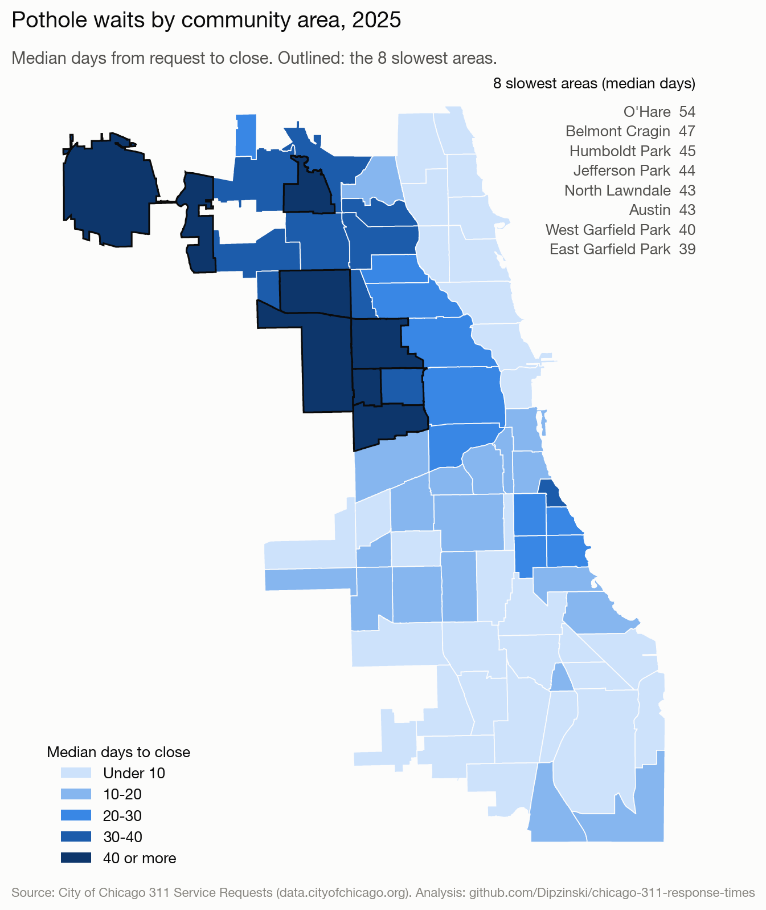
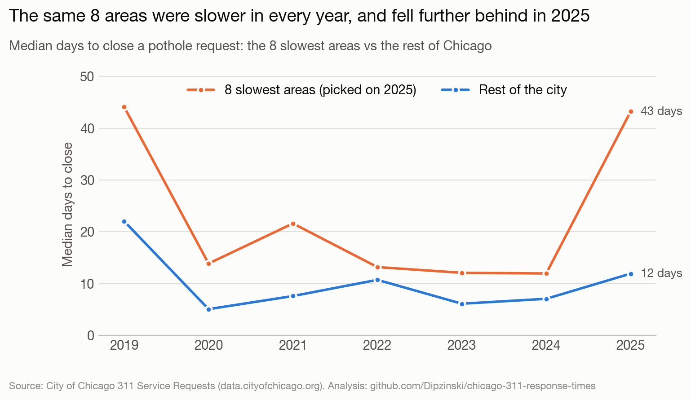
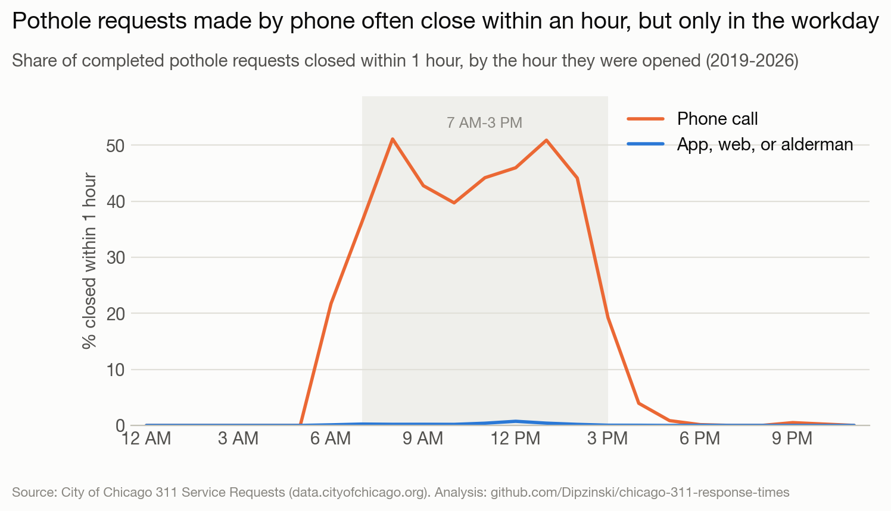
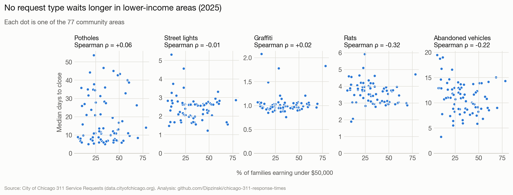
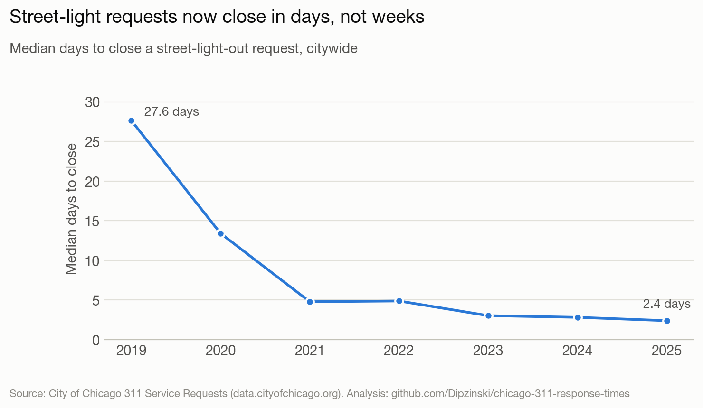

# Chicago 311 Response Times

**How long does Chicago take to fix potholes, street lights, graffiti, rats, and abandoned vehicles, and does the wait depend on where you live?**

This project pulls **2,262,000 311 service requests** (January 2019 to September 2026) from the City of Chicago's open-data API into **DuckDB**, cleans them with documented **SQL** rules and **11 automated data-quality checks**, and measures the days from request to close in all **77 community areas**. The analysis uses non-parametric tests (Kruskal-Wallis, Spearman) in Python, and the results are in an interactive dashboard.

**[Open the dashboard](https://dipzinski.github.io/chicago-311-response-times/)** · [Analysis notebook](analysis.ipynb) · [Cleaning rules (SQL)](sql/01_clean.sql) · [Data-quality checks (SQL)](sql/03_checks.sql)



## Key findings

**1. Pothole waits depend heavily on the neighborhood.** In 2025, the 8 slowest community areas had a median wait of **43.2 days** for a pothole request to close, vs **11.9 days** in the rest of the city (**3.6x**). Six of them form one connected block on the West Side and lower Northwest Side (Austin, Belmont Cragin, Humboldt Park, West and East Garfield Park, North Lawndale). The other two, Jefferson Park and O'Hare, are in the city's far northwest corner. The areas were picked using 2025 alone, yet they were also slower in every earlier year back to 2019 (1.2x to 2.8x). A Kruskal-Wallis test across the 77 areas gives an effect size of **ε² = 0.18** for potholes, about 7 times that of any other request type (0.012 to 0.026).



**2. Without cleaning, pothole waits look 43% shorter than they are.** 13.1% of requests come from the city's own operations (the dataset's own description), mostly graffiti jobs entered in bulk that close in under a minute. A further 3.1% close within an hour, which is too fast for a crew to be sent out. These are concentrated in pothole requests made by phone: **37%** of them close within an hour, vs **0.2%** of pothole requests from every other channel (app, web, aldermen's offices). It happens only during the workday (45% of phone requests opened 7 AM to 3 PM, 1.5% after 4 PM), although 311 takes calls around the clock, so these look like city staff logging work already done. Keeping both groups would put the 2024-25 pothole median at **5.6 days instead of 9.9**.



**3. Lower-income areas do not wait longer.** For each request type, I correlated each area's 2025 median wait with its share of families earning under $50,000 (Spearman, Bonferroni-corrected for 5 tests). No type waits longer in lower-income areas. Rat complaints close *faster* there (ρ = -0.32, corrected p = 0.02). Five of the 8 slow pothole areas are among the 25 areas with the most low-income families, but Jefferson Park and O'Hare are among those with the fewest, so income does not explain the pothole gap.



**4. Street-light requests now close in days, not weeks.** The median fell from **27.6 days in 2019 to 2.4 days in 2025 (11.5x faster)**, while the number of requests fell only 11% (33,772 to 30,177). The drop lines up with the city's LED streetlight program, which replaced more than 280,000 fixtures between 2017 and February 2022 ([source](https://www.ecmweb.com/lighting-control/article/21234319/chicago-completes-smart-lighting-streetlight-modernization-program)). The data alone can't show that the program caused it.



Also in the data: citywide pothole waits rose 79% in 2025, to a median of 13.5 days, and 18.6% of 2020 abandoned-vehicle requests (mostly February to July 2020) were never closed.

## Cleaning rules

Every downloaded request stays in the `requests` table with an `exclude_reason` ([sql/01_clean.sql](sql/01_clean.sql)). The rules run in order, so each request counts under the first rule that applies.

| Rule | Requests | Share | Why |
|---|---:|---:|---|
| Duplicate | 311,036 | 13.8% | A repeat report of a problem that already has an open request. It closes with the original, so counting it would double-count one repair. |
| City-logged work | 295,973 | 13.1% | Origins that the dataset says "result from the City's own operations" (Mass Entry, Generated In House, WOFromTerraGo). Median time to close: under 1 minute. |
| Closed within 1 hour | 70,064 | 3.1% | Too fast for a crew to be sent out; see finding 2. |
| Canceled | 12,266 | 0.5% | Never worked. |
| Legacy record, closed before opened | 0 | 0% | Checked, none found. |
| **Kept** | **1,572,661** | **69.5%** | |

Requests still open are kept but have no close date, so medians use closed requests only. In 2025, at most 1.7% of any request type is still open. The current year is partial, so trends stop at 2025.

## Data-quality checks

`scripts/build.py` runs [sql/03_checks.sql](sql/03_checks.sql) after every build and stops if any check fails:

1. `sr_number` is unique
2. Rows loaded match the API's count for each request type
3. Only the 5 requested request types
4. Every `created_date` falls inside the download window
5. Status is Open, Completed, or Canceled
6. Every completed request has a `closed_date`
7. `community_area` is between 1 and 77 when present
8. At most 1% of kept requests lack a community area (actual: 0.3%)
9. Cleaning keeps every raw row exactly once
10. Coordinates fall inside the Chicago area
11. All 77 community areas have a boundary and income data

## How it works

```
City of Chicago API ──► scripts/download.py ──► data/311.duckdb   (raw_requests, community_areas, acs_income)
                                                     │
                        sql/01_clean.sql   ──► requests         (one row per request + exclude_reason)
                        sql/02_metrics.sql ──► area_year_type, city_year_type, area_income
                        sql/03_checks.sql  ──► 11 data-quality checks (the build stops if one fails)
                                                     │
                 analysis.ipynb (tests and charts)       docs/ (dashboard on GitHub Pages)
```

- **Download:** the [Socrata API](https://dev.socrata.com/) returns up to 50,000 rows per request. The script pages through each request type by `sr_number` (keyset pagination, which stays correct while the city updates the data) and fetches the 5 types in parallel, with retries for the API's busy errors. It stops at midnight so the row counts and the pages describe the same snapshot.
- **SQL:** DuckDB runs the cleaning, the summaries (median and 90th percentile with `median()` and `quantile_cont()`), and the checks, all in plain SQL files.
- **Statistics:** Kruskal-Wallis tests whether waits differ across the 77 areas. It compares ranks, so a few extreme waits don't dominate. With thousands of requests almost any difference is "significant", so the effect size ε² is what gets compared. Spearman correlations test the link to income.
- **Dashboard:** `build.py` writes one JSON file (`docs/data.json`), and a static page draws the map, the trend, and a ranked table with [Plotly.js](https://plotly.com/javascript/), filtered by request type and year.

## Run it yourself

Python 3.9 or newer.

```bash
git clone https://github.com/Dipzinski/chicago-311-response-times.git
cd chicago-311-response-times
python3 -m venv .venv && source .venv/bin/activate
pip install -r requirements.txt
python scripts/download.py     # about 2.3M rows; 10-20 minutes, depending on the API
python scripts/build.py        # cleaning, summaries, checks, exports
jupyter notebook analysis.ipynb
```

To view the dashboard locally, run `python -m http.server -d docs` and open http://localhost:8000.

## Repository layout

| Path | What it holds |
|---|---|
| `scripts/download.py` | API download into DuckDB |
| `sql/01_clean.sql` | Cleaning rules: every request gets an `exclude_reason` |
| `sql/02_metrics.sql` | Median and 90th-percentile days to close by type, community area, and year; income by area |
| `sql/03_checks.sql` | Data-quality checks |
| `scripts/build.py` | Runs the SQL, the checks, and the exports |
| `analysis.ipynb` | Findings, statistical tests, and charts |
| `exports/` | Summary tables (CSV) and a simplified community-area map (GeoJSON) for Tableau or Excel |
| `docs/` | The dashboard page and its data |
| `charts/` | Charts used in this README |

## Limitations

- **Closed is not the same as fixed.** A request closes when the city marks it done. It can close after an inspection finds nothing to fix, and the dataset has no resolution code.
- **311 reflects who reports, not where problems are.** Request counts are not a measure of need.
- **The 1-hour rule is a judgment call.** A few real, very fast repairs are dropped with the logged work. The notebook shows the results with and without it.
- **Small areas are noisy.** O'Hare had 86 closed pothole requests in 2025, so its median moves a lot from year to year.
- **Income is an estimate.** The American Community Survey figures are 5-year survey estimates, re-aggregated from census tracts to community areas by the city.
- **Correlation is not cause.** The tests show where waits differ, not why. Crew districts, street types, weather, and budgets are not in the data.

## Data sources

All from the [City of Chicago Data Portal](https://data.cityofchicago.org), used under its terms of use:
- [311 Service Requests](https://data.cityofchicago.org/Service-Requests/311-Service-Requests/v6vf-nfxy) (`v6vf-nfxy`), requests created January 1, 2019 through September 28, 2026: graffiti 718,835; potholes 425,770; street lights 398,822; rats 384,302; abandoned vehicles 334,271
- [Boundaries - Community Areas](https://data.cityofchicago.org/d/igwz-8jzy) (`igwz-8jzy`)
- [ACS 5 Year Data by Community Area - Most Recent Year](https://data.cityofchicago.org/d/7umk-8dtw) (`7umk-8dtw`), American Community Survey estimates aggregated to community areas by the city

## About

Built by Kyle Dipzinski, B.S. Artificial Intelligence student at Illinois Institute of Technology in Chicago. [LinkedIn](https://www.linkedin.com/in/kyle-dipzinski-a136062b1/)

Tools: Python (requests, pandas, SciPy, matplotlib), DuckDB SQL, Jupyter, Plotly.js, GitHub Pages.
